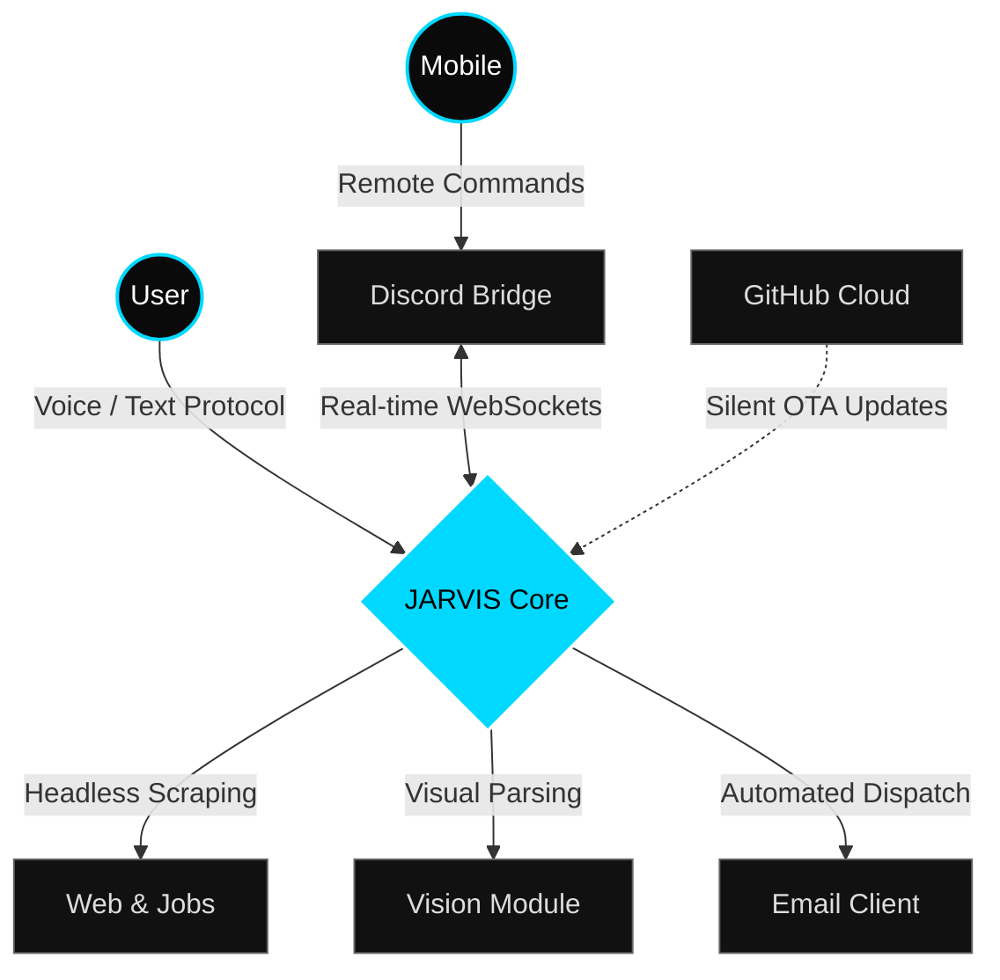

  <h1>J.A.R.V.I.S. System Architecture</h1>
  
<i>A highly-secure, fully autonomous AI desktop companion engineered for extreme productivity.</i>

  

    
    
    
  

  

 

---

 

  <h3>[ Primary Interface & Authentication Protocol ]</h3>
  

    
  

 

---

 

## Core Capabilities & Autonomous Engines

JARVIS is engineered to act as an independent operator rather than a passive assistant. The system hooks directly into your machine's environment and external APIs to execute complex operational workflows.

> **1. Deep Web Research & Autonomous Job Scraping**  
> Instruct JARVIS with a single voice command, and it will autonomously navigate search engines, parse dense articles, and scrape multi-platform job portals to synthesize tailored opportunities and actionable reports on your behalf.

> **2. Enterprise-Grade Email Automation**  
> Generates hyper-contextual responses, formats professional proposals, and seamlessly dispatches emails from your accounts. The entire drafting and sending process happens natively without you ever opening a browser window.

> **3. Contextual Image Recognition (Vision Engine)**  
> Built-in vision modules allow JARVIS to visually analyze on-screen elements, read complex graphical charts, and interpret visual data in real-time, providing deep contextual awareness of your workspace.

> **4. Discord Mobile Control Bridge**  
> Complete remote command access. JARVIS maintains a secure socket connection to a private Discord server, allowing you to control your PC, trigger heavy workflows, or query the AI system directly from your phone—anywhere in the world.

> **5. Impenetrable Security Vault**  
> All API keys, memory contexts, and personal configurations are secured behind a fully animated, impenetrable local PIN screen. Data remains encrypted on disk and rejects unauthorized hardware access dynamically.

> **6. Over-The-Air (OTA) Shadow Updates**  
> No manual updates required. The system constantly monitors the GitHub cloud registry. Upon detecting a new optimization or feature, it silently downloads the highly compressed update binary and patches itself without user intervention.

 

---

 

## System Workflow

As the core executable is fully closed-source and compiled natively, the flowchart below outlines the high-level architecture of how JARVIS bridges local hardware with cloud environments:

 

---

 

## Deployment Instructions

1. Navigate to the **[Releases](../../releases)** tab on this GitHub repository.
2. Download the latest `JARVIS_vX.X.X-Optimized.zip` release bundle.
3. Extract the entire folder to a dedicated directory on your PC (e.g., your Desktop).
4. Inside the extracted folder, double-click on `Jarvis.exe` to initialize the boot sequence.
   
> **CRITICAL WARNING:** Do **not** move the `Jarvis.exe` file out of its parent folder. The executable is a lightweight bootloader that relies entirely on the internal `_internal` dependency libraries located adjacent to it. Separating the file will result in a fatal boot failure.

 

---

 

## Aesthetic Configuration (The 6 Cores)

JARVIS includes a dynamic visual engine, allowing seamless transitions across six distinct visual core mappings. You can switch between these themes instantly to match your workspace environment.

<table align="center" style="border: none;">
  <tr style="border: none;">
    <td align="center" style="border: none;">
      
       <b>ARC REACTOR</b>
    </td>
    <td align="center" style="border: none;">
      
       <b>MATRIX</b>
    </td>
    <td align="center" style="border: none;">
      
       <b>DNA HELIX</b>
    </td>
  </tr>
  <tr style="border: none;">
    <td align="center" style="border: none;">
      
       <b>WAVE</b>
    </td>
    <td align="center" style="border: none;">
      
       <b>SINGULAR</b>
    </td>
    <td align="center" style="border: none;">
      
       <b>ORBITALS</b>
    </td>
  </tr>
</table>

> *THIS ARE THE THEMES AND CORE DESIGNS ARE AVAILABLE RIGHT NOW YOU CAN CHOOSE WHICH EVER YOU LIKE ACCORDING TO YOUR THEME SELECTION AND CORE CUSTOMIZATION*

  

  <i>System architecture optimized and packaged for high-performance distribution.</i>

